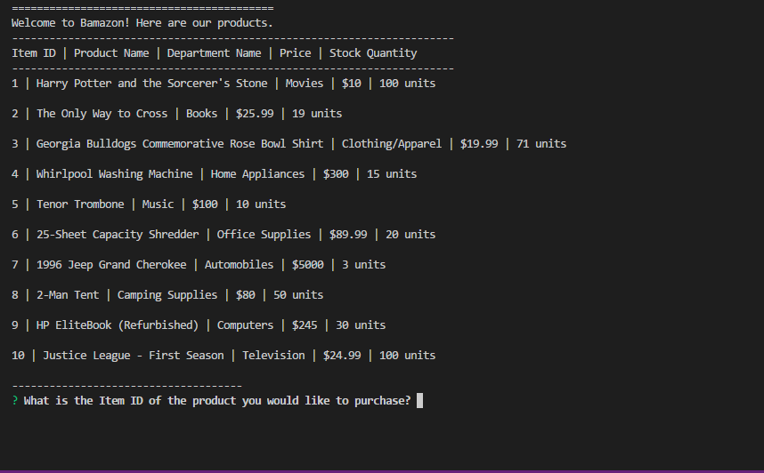
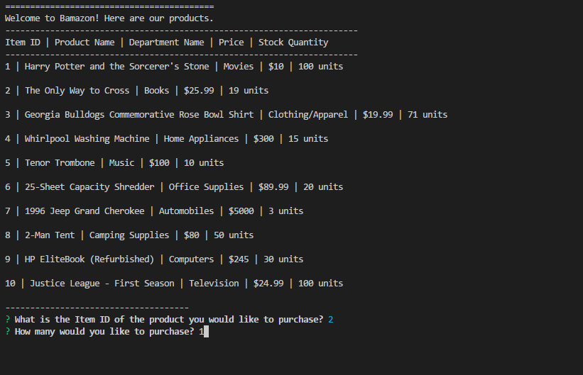
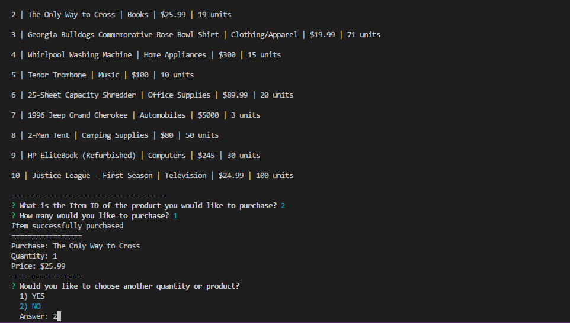
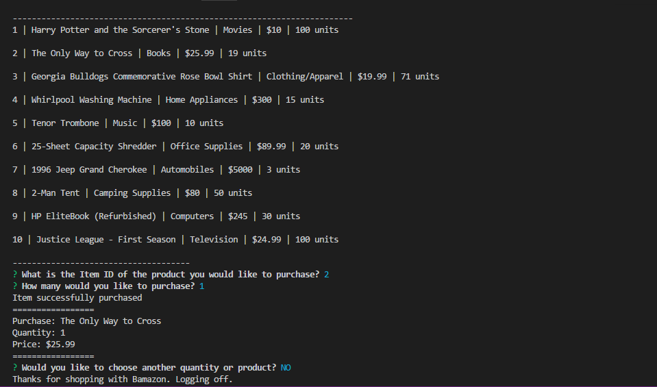

# Bamazon App

An Amazon-like Node-based application which is run from the command line and uses a MySQL database. It allows the user to view products, make selections, and see what was purchased.

## How to Use

User opens application by typing "node bamazonCustomer.js" in their terminal or command line. A listing of ten products with categories, prices, and stock quantity is shown and the user is asked for the Item ID of the product he or she would like to purhcase. After selecting what is wanted, the user is then asked to provide a quantity of the product to purchase.

If the quantity/product is not available, the user is asked if he or she would like to enter another quantity or purchase another product. If the user decides to return shopping, the process starts again with the product listing, and if the user decides against this, the app is closed.

If the quantity/product is available, the user is shown what has been purchased and the total cost, and is given the option to continue shopping. If he or she is finished, the app is closed.

After the end of a successful transaction, the quantity of the products is updated to reflect the purchase.

### Prerequisites

npm [inquirer](https://www.npmjs.com/package/inquirer)

npm [mysql](https://www.npmjs.com/package/mysql)

### Technologies Used

Language - Javascript

Run-time system - Node.js

Package manager - NPM

Database - MySQL

Text Editor - Visual Studio Code

## Preview

### Product Listing and Selection
- - - -

### Selecting the Quantity
- - - -

### Chosen Product and Further Shopping
- - - -

### End of Transaction and App Closed
- - - -

## Contributing

Please feel free to branch off with tweaks and making a repo; open to suggestions!

## Future Development

* Creating a proper table.
* Allow user to add multiple items to a single transaction.
* Creating similar and connected apps for managers and supervisors.

## Authors

* **Wesley Hutchins** - [Github](https://github.com/WesPres1990)